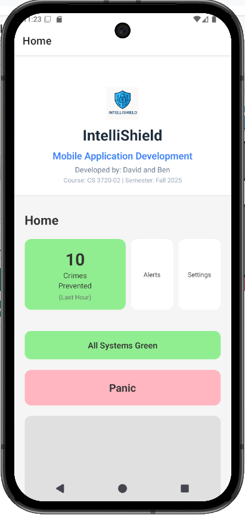
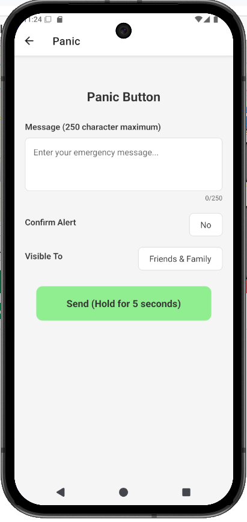
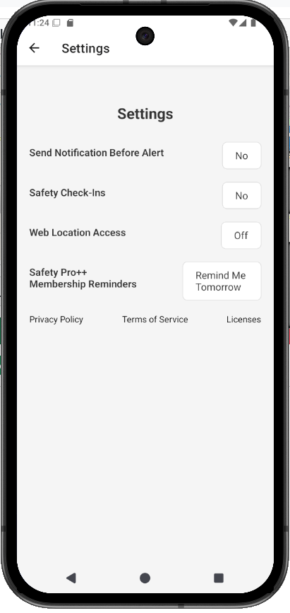
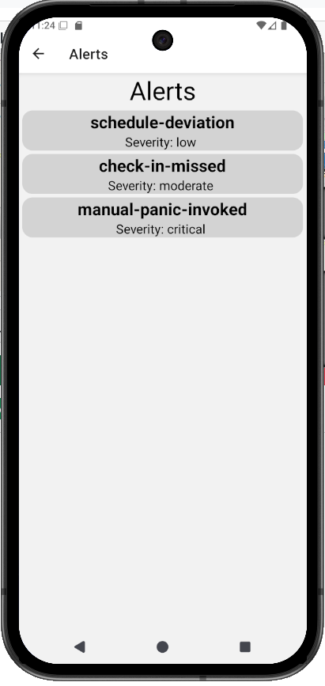
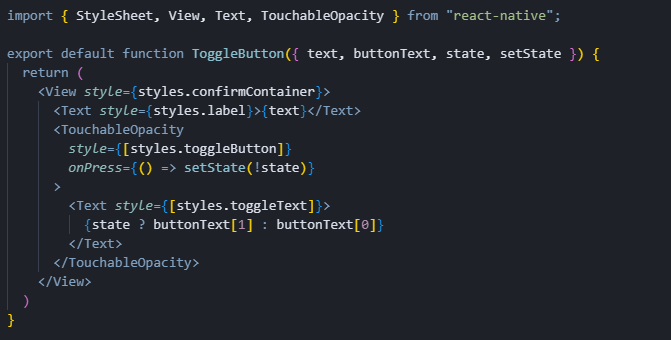
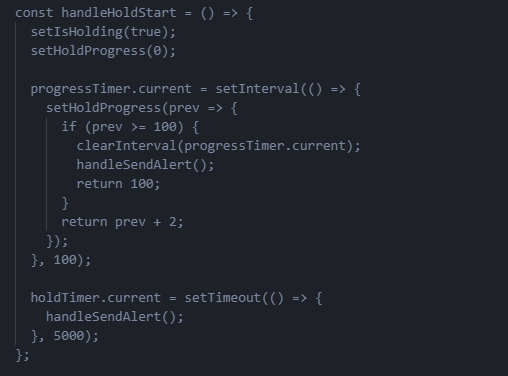

| Course: CS3720 Mobile Applications Development
| Activity: CS3720 Midterm Project
| Name: Ben Kobiske [kobiskeb@uwplatt.edu], David Touray [tourayd@uwplatt.edu]
| Professor: Dr. Abraham Aldaco
| Date: 2025-10-26

# App Overview

| Title: Intellishield

## Description

Intellishield protects you from physical dangers by monitoring your location for deviations and providing you with a robust set of safety enhancement features like scheduled check ins and automated anomily reporting. You can feel safe and secure knowing the eye of Intellishield is always watching over you.

## Purpose

Intellishield provides safety through location monitoring, intensive analysis of daily routines, and anomily detection. The app provides ways users can schedule check-ins if they're walking through areas where they could reasonably expect to get mugged or kidnapped. Alerts family members if an incident happens.

## Features

- Location Shield (location monitoring)
- Check-Ins
- Confirmations (confirms before dispatching alert to family)
- Web Based Monitoring

# Screenshots

## Home

{height=50%}

### Explaintation of Functionality

The home screen provides a jumping off point to the rest of the system. Additonally, it shows some statistics from your area so the user can make informed choices about how safe their area is. It also shows the connection status, indicating any location or network issues preventing full app functionality.

## Panic

{height=50%}

### Explaintation of Functionality

The panic page allows the user to manually initiate a panic alert to their family. They can supply a description and set the alert visibility. Additionally, a hold time is enforced to prevent misclicks.

## Settings

{height=50%}

### Explaintation of Functionality

The settings page allows users to configure the notification confirmation system, safety check-ins, and web location access (for enhanced privacy). Additionally, this page allows them to suspend Safety Pro++ Membership reminders for up to 24 whole hours. Links to legal information are also included.

## Alerts

{height=50%}

### Explaintation of Functionality

Alerts shows what Intellishield discovered for the user and their family members. This feed provides a simple view, at a glance, of what's going on in your Intelliguard community.

# AI Usage

I asked chat gpt how to implement a reusable toggle button component in React Native?

This component allowed me  to create a reusable toggle button that can be customized with different text labels and button states. Instead of writing the same toggle logic multiple times in the Settings screen, I created this single component that handles all toggle functionality.

I asked chat gpt how to implement a hold-to-activate button with progress bar in React Native?

This code helped us implement the crucial hold-to-activate functionality for the panic button, preventing accidental emergency alerts. The solution uses both a visual progress bar (updated every 100ms) and a 5-second timeout, giving users clear feedback that they need to hold the button.

# Reflection

## Learning Areas

This assignment assisted us with solidifying our knowledge of component based abstraction and the application of DRY principles in the React ecosystem. Additionally, we learned to work around the querks in React, React Native, and Expo Router. 

## Planned Improvements for Final Project

We plan to add server connectivity and better support for location monitoring (this isn't practical without a server to aggregate information). Additionally, we expect to implement improved lazy loading, data caching, and some more practical cache invalidation schemes to compliment the added networking functionality. 
